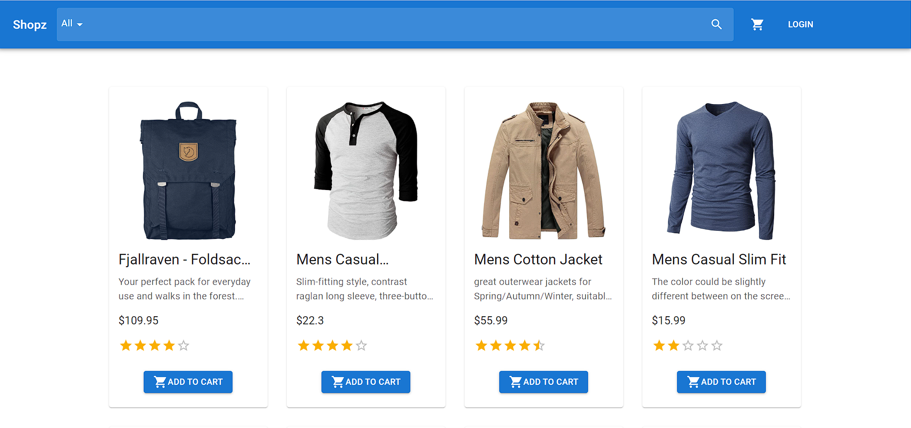
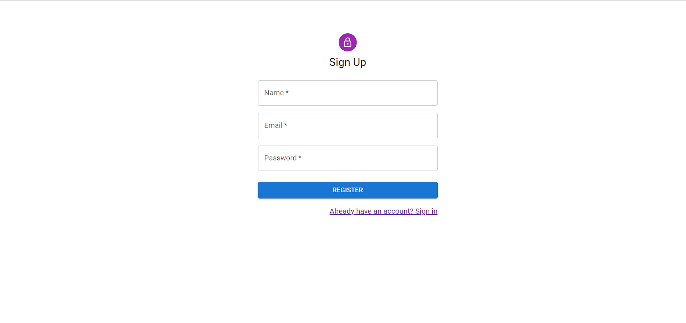
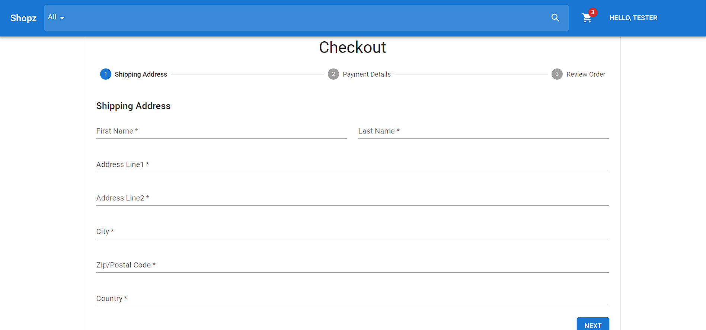
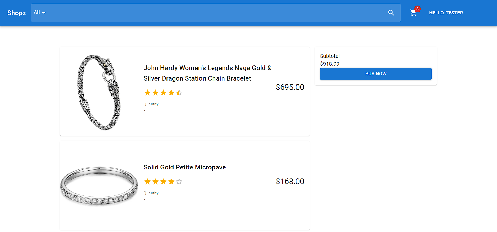

## E-Commerce-App

## Features

- Product Listing, Cart,Chekout, Singup/Signin Page
- Product Search
- Users can Add/Update/Delete Items to Cart
- Persists Data

## 🛠 Technologies Used
- React Js - `Javascript library to create UI`
- Redux Toolkit - `npm Package for state management`
- Firebase - `Backend-as-a-Service (Baas)`
- Material UI - `React component library that implements Google's Material Design`

## Demo
[-blue.svg)](https://ecomm-shopz.netlify.app)

  
## Installation
In the project directory, you can run:
## `pnpm install`

It will install all the necessary dependencies.

### `pnpm dev`

Runs the app in the development mode.\
Open [http://localhost:3000](http://localhost:3000) to view it in the browser.

The page will reload if you make edits.\
You will also see any lint errors in the console.

### `pnpm build`

Builds the app for production to the `build` folder.\
It correctly bundles React in production mode and optimizes the build for the best performance.

The build is minified and the filenames include the hashes.\
Your app is ready to be deployed!
